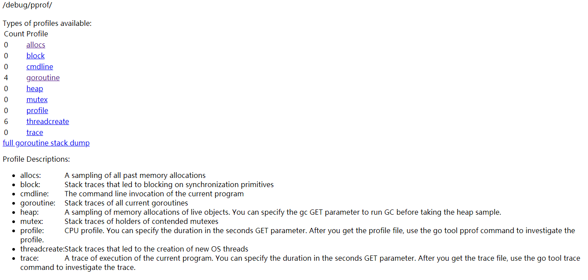

# 性能剖析工具PProf

## 第一节：压力测试工具ab

### ab工具介绍

ab是apache自带的压力测试工具。ab非常实用，它不仅可以对apache服务器进行网站访问压力测试，也可以对或其它类型的服务器进行压力测试。比如nginx、tomcat、IIS等

### 安装

```csharp
yum -y install httpd-tools # centos，redhat

apt-get install apache2-utils   #ubuntu Debian 
```

### 使用说明

```swift
# 格式
ab -n1000 -c 10 http:/www.snail.com/ 
```

常用参数说明：

```
-n  即requests，用于指定压力测试总共的执行次数。
-c  即concurrency，用于指定压力测试的并发数。
-t  即timelimit，等待响应的最大时间(单位：秒)。
```

```
# -n发出800个请求，-c模拟800并发，相当800人同时访问，后面是测试url
ab -n 800 -c 800  http://192.168.0.10/ 

#在60秒内发请求，一次100个并发请求。
ab -t 60 -c 100 http://192.168.0.10/ 
```

更多使用方法详见 [ab 官方文档](http://httpd.apache.org/docs/2.0/programs/ab.html)

### 结果说明

```
Server Software:        Apache          #服务器软件
Server Hostname:        www.taoquan.ink #域名
Server Port:            80              #请求端口号

Document Path:          /               #文件路径
Document Length:        40888 bytes     #页面字节数

Concurrency Level:      10              #请求的并发数
Time taken for tests:   27.300 seconds  #总访问时间
Complete requests:      1000            #请求成功数量
Failed requests:        0               #请求失败数量
Write errors:           0
Total transferred:      41054242 bytes  #请求总数据大小（包括header头信息）
HTML transferred:       40888000 bytes  #html页面实际总字节数
Requests per second:    36.63 [#/sec] (mean)  #每秒多少请求，这个是非常重要的参数数值，服务器的吞吐量
Time per request:       272.998 [ms] (mean)     #用户平均请求等待时间 
Time per request:       27.300 [ms] (mean, across all concurrent requests) # 服务器平均处理时间，也就是服务器吞吐量的倒数                  
Transfer rate:          1468.58 [Kbytes/sec] received  #每秒获取的数据长度

Connection Times (ms)
              min  mean[+/-sd] median   max
Connect:       43   47   2.4     47      53
Processing:   189  224  40.7    215     895
Waiting:      102  128  38.6    118     794
Total:        233  270  41.3    263     945

Percentage of the requests served within a certain time (ms)
  50%    263    #50%用户请求在263ms内返回
  66%    271    #66%用户请求在271ms内返回
  75%    279    #75%用户请求在279ms内返回
  80%    285    #80%用户请求在285ms内返回
  90%    303    #90%用户请求在303ms内返回
  95%    320    #95%用户请求在320ms内返回
  98%    341    #98%用户请求在341ms内返回
  99%    373    #99%用户请求在373ms内返回
 100%    945 (longest request)
```


------

## 第二节：PProf简介

### PProf是什么

PProf是分析性能、分析数据的工具，并支持可视化的图形分析。**是Go语言中必知必会的技能点**。

### PProf使用姿势

采样方式

- `runtime/pprof`：采集程序（非Server）指定区块的运行数据进行分析。·
- `net/http/pprof`：基于HTTP Server运行，并且可以采集运行时的数据进行分析。·
- `go test`：通过运行测试用例，指定所需标识进行采集。

使用方式

- Report Generation：报告生成。
- Interactive Terminal Use：交互式终端使用。
- Web Interface：Web界面。

### PProf可以做什么

-  CPU Profiling：CPU分析。按照一定的频率采集所监听的应用程序CPU（含寄存器）的使用情况，确定应用程序在主动消耗CPU周期时花费时间的位置。·
- Memory Profiling：内存分析。在应用程序进行堆分配时记录堆栈跟踪，用于监视当前和历史内存使用情况，以及检查内存泄漏。·
- Block Profiling：阻塞分析。记录goroutine阻塞等待同步（包括定时器通道）的位置，默认不开启，需要调用runtime.SetBlockProfileRate进行设置。·
- Mutex Profiling：互斥锁分析。报告互斥锁的竞争情况，默认不开启，需要调用runtime.SetMutexProfileFraction进行设置。
- Goroutine Profiling：goroutine分析，可以对当前应用程序正在运行的goroutine进行堆栈跟踪和分析。这项功能在实际排查中会经常用到，因为很多问题出现时的表象就是goroutine暴增，而这时候我们要做的事情之一就是查看应用程序中的 goroutine 正在做什么事情，因为什么阻塞了，然后再进行下一步分析。


------


## 第三节：PProf的使用

### 一个简单的例子：

```
package main

import (
	"fmt"
	"net/http"
	_ "net/http/pprof" // 第一步～
)

// 创建map不指定容量
func makeMap1() map[int]int {
	mp := make(map[int]int)
	for i:=0;i<100000;i++{
		mp[i] = i
	}
	return mp
}
// 创建map指定容量
func makeMap2() map[int]int {
	mp := make(map[int]int,100000)
	for i:=0;i<100000;i++{
		mp[i] = i
	}
	return mp
}

func test1(w http.ResponseWriter, r *http.Request){
	makeMap1()
	makeMap2()
	fmt.Println(1111)
}

func main() {
	// 路由配置
	http.HandleFunc("/test1", test1)
	_ =http.ListenAndServe("0.0.0.0:6061", nil)
}
```

说明：

1. 在import中添加对`“net/http/pprof”`的引用
2. 访问http://服务器地址:端口/debug/pprof/地址，检查是否正常响应

### 通过浏览器访问

首页信息




| 类型         | 描述                                      |
| ------------ | ----------------------------------------- |
| allocs       | **内存分配**情况的采样信息                |
| blocks       | **阻塞**操作情况的采样信息                |
| cmdline      | 显示程序启动**命令和其完整路径            |
| goroutine    | 显示当前所有**协程**的堆栈信息            |
| heap         | **堆**上的内存分配情况的采样信息          |
| mutex        | **锁**竞争情况的采样信息                  |
| profile      | **cpu**占用情况的采样信息，点击会下载文件 |
| threadcreate | 系统OS**线程**创建情况的采样信息          |
| trace        | 程序**运行跟踪**信息                      |

说明：

1. `?debug=1`,可以直接在浏览器中访问。
2. 不新增debug参数，那么将会直接下载对应的profile文件。
3. 在部署环境中，我们为了网络安全，通常不会直接对外网暴露 PProf 的相关端口，因此会通过curl、wget等方式进行profile文件的间接拉取
4. 在实际场景中，我们常常需要及时将当前状态下的profile文件给存储下来，便于二次分析。