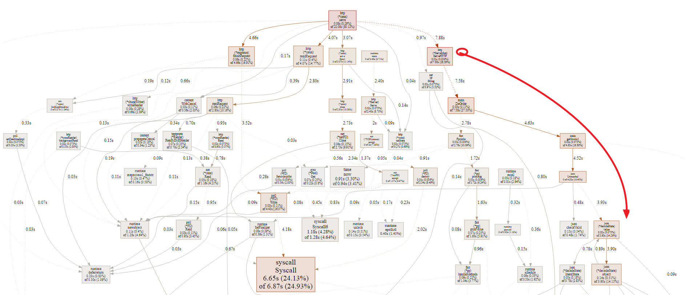
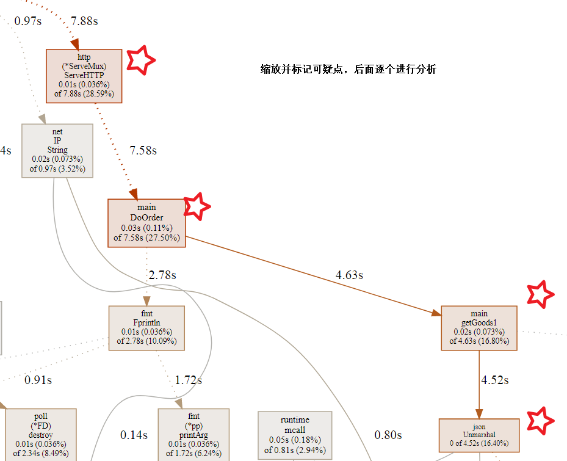
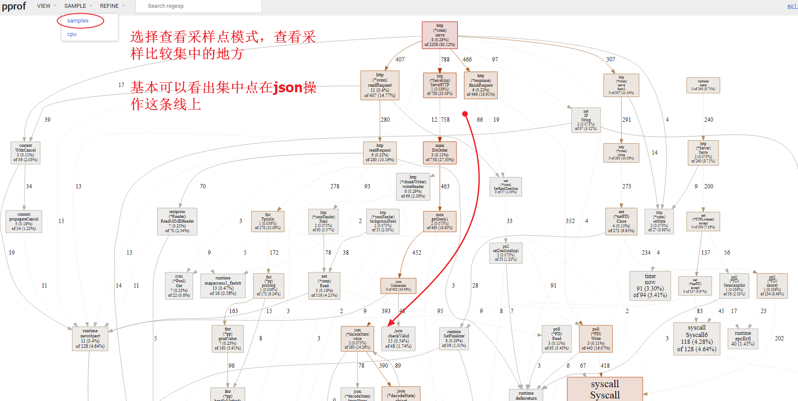
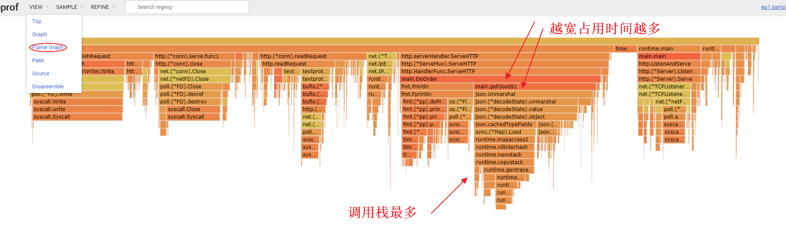
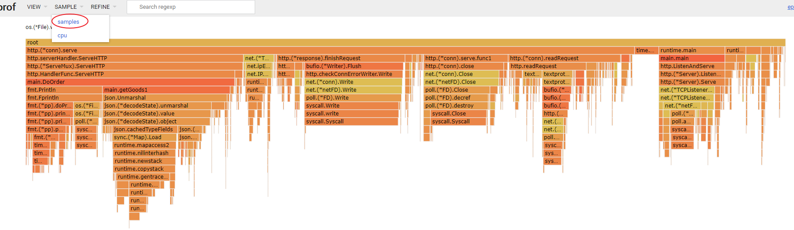
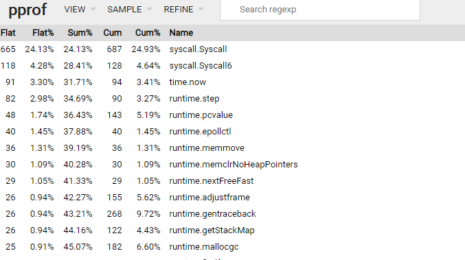
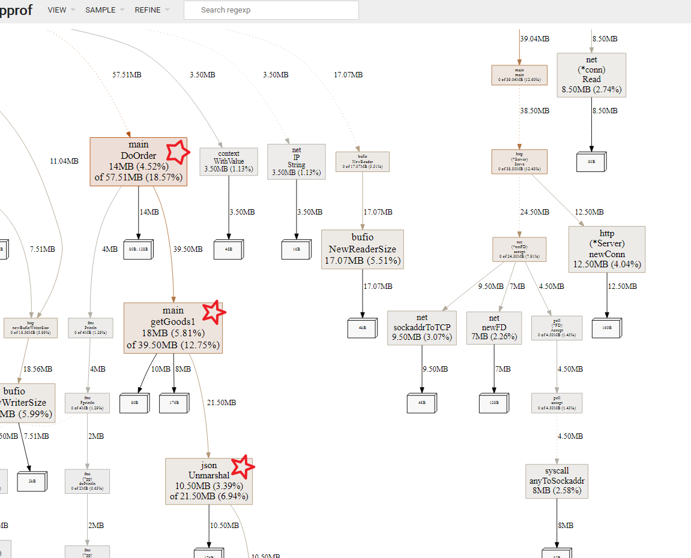

# 实例分析说明

## 第一例概述：CPU出现持续飙升，甚至导致系统崩溃，内存无异常

### 场景再现：

一个并发活动，并发量大于1万，突然出现了问题，页面半天打不开，打开了半天下不了单，cpu涨了又跌跌了又涨，领导发飙，运营骂娘。于是技术团队开始定位bug，看了好几圈都没有发现问题，重启也没有解决问题....


### 分析问题，提出假设和疑问

为什么单独CPU消耗这么大？为什么还有波动？

#### 猜测和假设出CPU暴涨的原因：

1. 某段代码逻辑计算密度过大
2. GC压力过大？（小对象太多？）
3. 依赖接口请求延迟，导致在高并发环境下请求积压越来越多？

有了初步的分析和假设，下一步我们来一起定位问题

### 定位问题，使用趁手的工具

#### 1、用`pprof`工具定位

很多小伙伴担心线上使用`pprof`会影响性能，担心安全问题。这个在我看来利大于弊，当服务出现问题的时候，资源占用多一点点与能够解决问题相比微不足道，当服务没有问题的时候使用`pprof`那更没有问题了

```
//命令参考

// 获取分析cpu的文件
wget http://127.0.0.1:6061/debug/pprof/profile?seconds=60

// 执行分析
go tool pprof -http=:8000 profile
```


#### 2、看Graph图了解全局的一个大体情况

**下图展示了函数逻辑调用树，框越红，越大表示消耗越多！**




#### 3、捕获可疑点




view选择Graph不变，SAMPLE里选择samples，查看采样信息




#### 4、再看flame图





我们可以看到其实采样`SAMPLE`中选择`cpu`或者`samples`都差不多，消耗越大的地方`CPU`占用越高，采样点也是越集中在这里！

#### 5、再看Top



Flat：函数自身运行耗时

Flat%：函数自身耗时比例

Sum%：指的就是每一行的flat%与上面所有行的flat%总和

Cum：当前函数加上它之上的调用运行总耗时

Cum%：当前函数加上它之上的调用运行总耗时比例

#### 6、看看内存分配情况

```
//命令参考

// 获取分析cpu的文件
wget http://127.0.0.1:6061/debug/pprof/heap

// 执行分析
go tool pprof -http=:8000 profile
```




- `alloc_objects`：收集自程序启动以来，累计的分配对象数
-  `alloc_space`：收集自程序启动以来，累计的分配空间
-  `inuse_objects`：收集实时的正在使用的分配对象数
-  `inuse_space`：收集实时的正在使用的分配空间

### 分析和解决问题

我们基本清楚了程序性能消耗大户就在json.Unmarshal这一块。


既然我们知道了是json反序列化的问题导致这次线上事故的产生，那么这个问题我们该如何解决呢？


这个很容易想到，既然标准库中的json序列化效率不高，咱们换个高效率的不就行了吗？例如：[https://github.com/json-iterator/go](https://links.jianshu.com/go?to=https%3A%2F%2Fgithub.com%2Fjson-iterator%2Fgo)


我的看法是：**脱离业务谈技术的都是耍流氓！**


## 总结

首先得分析问题，是`CPU`问题还是内存问题，又或者是网络问题。当三者都没问题的时候，请你压一压是不是自己程序性能有问题···

其次常用的性能分析工具要掌握，`pprof`肯定不用说，还有一些`Linux`命令例如`top`，`uptime`，还有查看`TCP`连接数的等等命令。

当能够充分定位问题的时候，首先得梳理清楚业务流程，因为一般我们用的包或者标准库，亦或是框架，他们的性能相差其实也没有大到很离谱，除非你故意挑个玩具代码来应用到生产环境。

先确认业务流程和程序处理上已经没有优化的空间，请再考虑寻找一个高效的库，或者自己去实现一些代码优化措施！