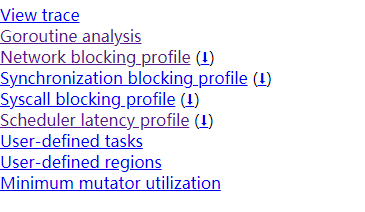
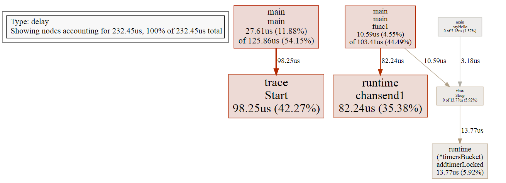
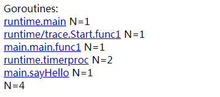
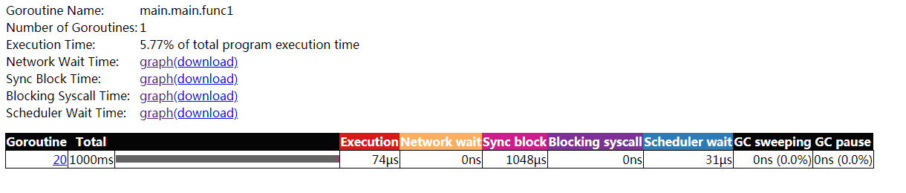

# Go调优工具-trace介绍

很多时候，仅仅使用 PProf 不一定能完整地观察并解决问题，这是因为在真实的程序中包含了许多的隐藏动作，例如，goroutine在执行时会做哪些操作？执行/阻塞了多长时间？在什么时候阻止的？在哪里被阻止的？谁又锁/解锁了它们？GC是如何影响goroutine的执行的？这些问题用PProf是很难分析出来的，这时可以用本节的主角trace来解决。

## 如何使用trace

1. 标准库导入runtime/trace

2. 使用trace.Start() 和 trace.Stop()开启和关闭trace，并生成跟踪文件

3. 使用`go tool trace trace文件` 解析跟踪文件，并使用可视化程序打开浏览器

```
package main
import (
	"fmt"
	"os"
	"runtime/trace"
	"time"
)

func main() {
	f, err := os.Create("trace.out")
	if err != nil {
		panic(err)
	}
	defer f.Close()

	err = trace.Start(f)
	ch := make(chan string)
	go func(){
		time.Sleep(time.Second)
		ch<- "裸奔的蜗牛，黑乎乎"
		say := make(chan string)
		go sayHello(say)
		fmt.Println(<-say)
	}()
	fmt.Println(<-ch)
	if err != nil {
		panic(err)
	}
	defer trace.Stop()
	// Your program here
}

func sayHello(s chan string){
	time.Sleep(time.Second)
	s<- "hello"
}
```

执行：

```
 go tool trace trace.out
```

开启浏览器：



1. View trace：查看跟踪。
2.  Goroutine analysis：goroutine 分析。
3. Network blocking_profile：网络阻塞概况。
4. Synchronization blocking_profile：同步阻塞概况。
5. Syscall blocking_profile：系统调用阻塞概况。
6. Scheduler latency profile：调度延迟概况。
7. User defined tasks：用户自定义任务。
8.  User defined regions：用户自定义区域。
9. Minimum mutator utilization：最低 mutator 利用率。

## trace分析说明

### 1、调度延迟概述

在查看问题时，除非有很明显的迹象，否则不应该一开始就陷入细节。一般来说，应先查看`Scheduler latency profile`，即通过Graph查看整体的调用开销情况，如下图所示。




### 2、goroutine分析

通过`Goroutine analysis`这个功能我们可以看到在整个运行过程中，每个函数块有多少个goroutine在执行，并且每个Goroutine的运行开销都花费在哪个阶段，



可以看到，共有4个goroutine，分别是`runtime.main`、`runtime/trace.Start.func1`、`main.main.func1`和`main.sayHello`。它们都做了哪些事情呢？

下面单击具体项来查看，如下图所示。可



参数说明：


| 名称 | 含义 | 耗时 |
| ---- | ---- | ---- |
|      |      |      |
|      |      |      |
|      |      |      |
|      |      |      |
|      |      |      |
|      |      |      |

可以看到当前goroutine在整个调用耗时中的占比，以及GC清扫和GC暂停等待的一些开销。另外，还可以把图表下载下来，再进行分析，这相当于把整个goroutine运行时给拆分了，这可以很好地帮助我们对goroutine运行阶段做一个细致的剖析，进而知道到底哪里出了问题，然后再决定下一步的排查方向


参考：

1. https://blog.csdn.net/qiya2007/article/details/109588676
2. https://www.cnblogs.com/-lee/p/12718025.html
3. https://studygolang.com/articles/9693
4. https://mp.weixin.qq.com/s?__biz=MzAxMTA4Njc0OQ==&mid=2651439006&idx=1&sn=0db8849336cc4172c663a574212ea8db&chksm=80bb616cb7cce87a1dc529e6c8bdcf770e293fc4ce67ede8e1908199480534c39f79803038e3&scene=21#wechat_redirect