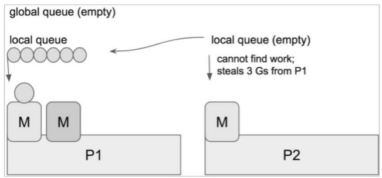

# Go调优工具-GODEBUG

GODEBUG是Go语言中十分强大的工具之一，GODEBUG可以让Go程序在运行时输出调试信息。通过GODEBUG我们可以很直观地看到调度器或垃圾回收等详细信息，并且不需要安装其他插件，非常方便。

## GODEBUG基础知识

Go Scheduler的主要功能是对在处理器上运行的OS线程分发可运行的goroutine。一般来说，一提到调度器，就不得不提三个缩写，具体如下。

1. G：goroutine，实际上，每次调用go func时都会生成一个G。
2.  P：Processor，处理器，一般P的数量就是处理器的核数，可以通过GOMAXPROCS 进行修改。
3.  M：Machine，OS线程。

这三者的交互实际上来源于Go的M：N 调度模型，也就是说，M必须与P进行绑定，然后不断地在M上循环寻找可运行的G来执行相应的任务，具体内容可以详细阅读[Go Runtime Scheduler](https://www.jianshu.com/p/2f5b0aaec856)。Go Scheduler的工作流程如图

- 当执行go func（）时，实际上就是创建了一个全新的goroutine，我们称它为G。·
- 新创建的G会被放入P的本地队列（local queue）或全局队列（global queue）中，准备下一步的动作，注意这里的P指的是创建G的P。
- 唤醒或创建M以便执行G。
- 不断地进行事件循环。
- 寻找可用状态下的G执行任务。
- 清除后，重新进入事件循环。

上面提到的全局队列和本地队列，从功能上来说都是存放正在等待运行的G的，不同之处在于，本地队列有数量限制，即不允许超过256个，并且在新建G时，会优先选择P的本地队列。如果本地队列满了，则将P的本地队列中的一半的G移到全局队列，这其实可以理解为调度资源的共享和再平衡。

另外，上图中的steal行为是用来做什么的呢？当创建新的G或者G变成可运行状态时，它会被推送并加入当前P的本地队列中。当P执行G完毕后，它开始“干活”，它会从本地队列中弹出G，同时检查当前本地队列是否为空。如果为空，则会随机地从其他P的本地队列中尝试窃取一半可运行的G到自己的名下，如下图所示。

在这个例子中，P2 在本地队列中找不到可以运行的 G，因而它会执行steal 调度算法，随机选择其他处理器P1，并从P1的本地队列中窃取三个G到它自己的本地队列中。至此，P1、P2都拥有了可执行的G。P1中多余的G也不会被浪费，调度资源会更加平均的在多个处理器中进行流转。

## 开始GODEBUG

## 参考：

1. GODEBUG